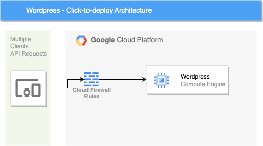

# terraform-google-canonical-mp

This module deloys a [WordPress Google Click to Deploy Solution](https://console.cloud.google.com/marketplace/product/click-to-deploy-images/wordpress) from Marketplace.

## Description
### Tagline
WordPress Google Click to Deploy Solution

### Detailed
This module deloys a WordPress Google Click to Deploy Solution from Marketplace.

### PreDeploy
To deploy this blueprint you must have an active billing account and billing permissions.

## Architecture

1. Clients request content by querying the web url.
2. Requests reach GCP via a public IP and are evaluated by the firewall.
3. Valid requests pass through the firewall and reach the wordpress GCE instance to serve content.

## Documentation
- [Hosting a Static Website](https://cloud.google.com/storage/docs/hosting-static-website)

## Deployment Duration
Configuration: 1 mins
Deployment: 5 mins

## Cost
[Wordpress cost details](https://cloud.google.com/products/calculator#id=d2a82f67-ff05-4179-9e15-9682ef77a663)

## Usage

Basic usage of this module is as follows:

```hcl
module "canonical_mp" {
  source  = "terraform-google-modules/canonical-mp/google"
  version = "~> 0.1"

  project_id           = var.project_id
  name                 = "wordpress-simple"
  zone                 = "us-west1-a"
  source_image         = "wordpress-v20220821"
  source_image_project = "click-to-deploy-images"
  machine_type         = "n2-standard-4"
  boot_disk_type       = "pd-standard"
  boot_disk_size       = "100"
  enable_logging       = true
  enable_monitoring    = true
  install_phpmyadmin   = true

  ip_source_ranges = {
    80  = "0.0.0.0/0"
    443 = "0.0.0.0/0"
  }

  network_interfaces = [
    {
      network     = "default"
      subnetwork  = "default"
      external_ip = "Ephemeral"
    },
  ]
}
```

Functional examples are included in the
[examples](./examples/) directory.

<!-- BEGINNING OF PRE-COMMIT-TERRAFORM DOCS HOOK -->
## Inputs

| Name | Description | Type | Default | Required |
|------|-------------|------|---------|:--------:|
| boot\_disk\_size | The boot disk size for the VM instance in GBs | `string` | `"10"` | no |
| boot\_disk\_type | The boot disk type for the VM instance. | `string` | `"pd-standard"` | no |
| enable\_https | Enabled HTTPS communication for Wordpress | `bool` | `false` | no |
| enable\_logging | Enable cloud logging for the VM instance. | `bool` | n/a | yes |
| enable\_monitoring | Enable cloud monitoring for the VM instance. | `bool` | n/a | yes |
| enable\_tcp\_443 | Enable network traffic over port 443 for Wordpress | `bool` | `false` | no |
| enable\_tcp\_80 | Enable network traffic over port 80 for Wordpress | `bool` | `false` | no |
| external\_ips | The external IPs assigned to the VM for public access. | `list(string)` | <pre>[<br>  "EPHEMERAL"<br>]</pre> | no |
| install\_phpmyadmin | Install phpMyAdmin on the VM instance | `bool` | `true` | no |
| machine\_type | The machine type to create, e.g. e2-small | `string` | `"n2-standard-4"` | no |
| name | The name of the VM instance for the deployment. | `string` | n/a | yes |
| networks | The network name to attach the VM instance. | `list(string)` | <pre>[<br>  "default"<br>]</pre> | no |
| project\_id | The ID of the project in which to provision resources. | `string` | n/a | yes |
| source\_image | The image name for the disk for the VM instance. | `string` | n/a | yes |
| source\_image\_project | The project name where the solution image is stored. | `string` | `"click-to-deploy-images"` | no |
| sub\_networks | The sub network name to attach the VM instance. | `list(string)` | <pre>[<br>  "default"<br>]</pre> | no |
| tcp\_443\_ip\_source\_ranges | A comma seperated string of source IP ranges for accessing the VM instance over HTTPS port 443. | `string` | n/a | yes |
| tcp\_80\_ip\_source\_ranges | A comma seperated string of source IP ranges for accessing the VM instance over HTTP port 80. | `string` | n/a | yes |
| wp\_admin\_email | The email address for Wordpress admin. | `string` | n/a | yes |
| zone | The zone for the solution to be deployed. | `string` | `"us-west1-a"` | no |

## Outputs

| Name | Description |
|------|-------------|
| admin\_password | Password for the admin user |
| admin\_user | Admin username for Wordpress |
| has\_external\_ip | Flag to indicate if the wordpress machine has an external IP |
| instance\_machine\_type | Machine type for the wordpress compute instance |
| instance\_nat\_ip | Machine type for the wordpress compute instance |
| instance\_network | Machine type for the wordpress compute instance |
| instance\_self\_link | Self-link for the Wordpress compute instance |
| instance\_zone | Zone for the wordpress compute instance |
| mysql\_password | Password for the MySql user |
| root\_password | Password for the root user |

<!-- END OF PRE-COMMIT-TERRAFORM DOCS HOOK -->

## Requirements

These sections describe requirements for using this module.

### Software

The following dependencies must be available:

- [Terraform][terraform] v0.13
- [Terraform Provider for GCP][terraform-provider-gcp] plugin v3.0

### Service Account

A service account with the following roles must be used to provision
the resources of this module:

- Storage Admin: `roles/compute.admin`

The [Project Factory module][project-factory-module] and the
[IAM module][iam-module] may be used in combination to provision a
service account with the necessary roles applied.

### APIs

A project with the following APIs enabled must be used to host the
resources of this module:

- Google Compute API: `compute.googleapis.com`

The [Project Factory module][project-factory-module] can be used to
provision a project with the necessary APIs enabled.

## Contributing

Refer to the [contribution guidelines](./CONTRIBUTING.md) for
information on contributing to this module.

[iam-module]: https://registry.terraform.io/modules/terraform-google-modules/iam/google
[project-factory-module]: https://registry.terraform.io/modules/terraform-google-modules/project-factory/google
[terraform-provider-gcp]: https://www.terraform.io/docs/providers/google/index.html
[terraform]: https://www.terraform.io/downloads.html

## Security Disclosures

Please see our [security disclosure process](./SECURITY.md).
